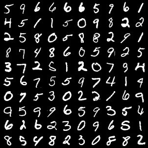
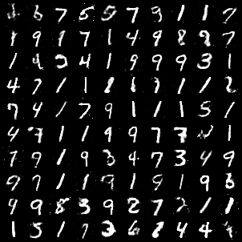

# Handwritten Digit Generation using GANs
### Training a Generative Adversarial Network on the MNIST Dataset

## Project Overview
This project implements a **Generative Adversarial Network (GAN)** to generate realistic handwritten digit images, trained on the **MNIST** dataset. A **GAN** consists of two neural networks competing against each other: 
- The **Generator**, which generates fake images.
- The **Discriminator**, which evaluates the authenticity of both real and fake images.

The goal is for the generator to produce increasingly realistic images while the discriminator improves its ability to distinguish between real and fake images.

## Dataset
We use the **MNIST** dataset, which contains 70,000 grayscale images of handwritten digits (0-9). Each image is 28x28 pixels.

## Network Architecture
### Discriminator
- Input: 28x28 flattened image (784 nodes)
- Hidden layers: Two fully connected layers with 256 nodes each
- Activation: Leaky ReLU
- Output: Binary classification (real or fake)

### Generator
- Input: Random noise vector of size 64
- Hidden layers: Two fully connected layers with 256 nodes each
- Activation: ReLU (hidden layers) and Tanh (output layer)
- Output: 784-node output reshaped into a 28x28 image

## Installation
To run this project locally, follow these steps:

1. Clone the repository:
    ```bash
    git clone https://github.com/mr-seifi/mnist-gan.git
    ```
2. Navigate to the project directory:
    ```bash
    cd mnist-gan
    ```
3. Install the required dependencies:
    ```bash
    pip install -r requirements.txt
    ```

    The key dependencies are:
    - `torch`
    - `torchvision`
    - `matplotlib`

4. Download the MNIST dataset (this will happen automatically during runtime).

## Training the GAN

The training process involves:
- **Discriminator Training**: The discriminator learns to classify real vs. fake images by optimizing its ability to distinguish between actual MNIST images and those generated by the generator.
- **Generator Training**: The generator is trained to improve its ability to generate realistic images by minimizing the probability that the discriminator successfully identifies its images as fake.

### Key Components in the Training:
- **Loss Function**: Binary Cross-Entropy (BCE) loss is used for both generator and discriminator.
- **Optimizers**: Adam optimizer with a learning rate of 0.0001 for both networks.
- **Epochs**: The network is trained for 300 epochs, with fake images generated and saved at each epoch.

## Results
### Real Images:
The real images from the MNIST dataset:

`

### Generated Fake Images:
The generated images after training:



The generated images improve over time, as the generator learns to create more realistic images by competing against the discriminator.

## References
- **Goodfellow et al., 2014**: [Generative Adversarial Networks](https://arxiv.org/abs/1406.2661)
- **PyTorch Documentation**: [PyTorch](https://pytorch.org/)
- **MNIST Dataset**: [MNIST Database](http://yann.lecun.com/exdb/mnist/)